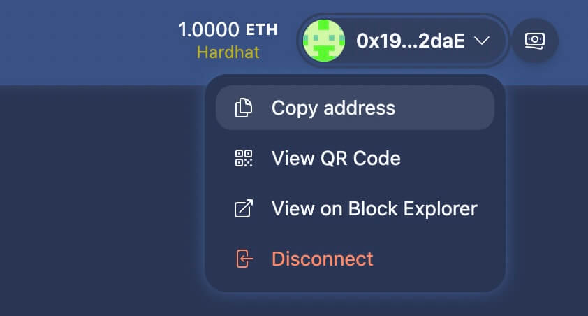
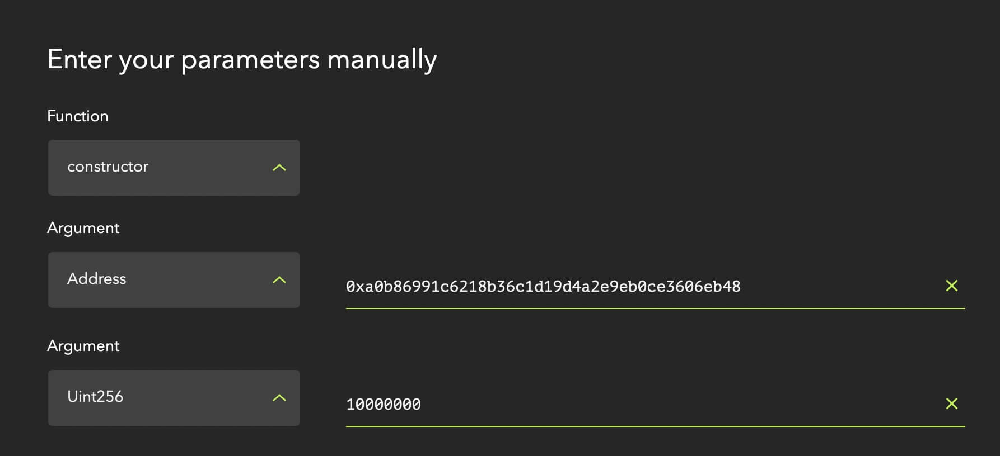

# 🏗 ~~Scaffold-ETH 2~~ Scaffold-Lens

This project is a fork of [Scaffold-ETH 2](https://github.com/scaffold-eth/scaffold-eth-2) that demonstrates how to build, debug, test, and deploy an [Open Action](https://docs.lens.xyz/docs/publication-actions-aka-open-actions) Module on Lens Protocol using [Hardhat](https://hardhat.org/).

Features:
- ✅ Run a local EVM chain and test contracts locally with Hardhat
- ✅ Deploy a mock ModuleRegistry contract
- ✅ Deploy an ERC20 token contract used for whitelisted tips
- ✅ Deploy an Open Action Module contract
- ✅ Debug local contract calls with a graphical interface
- ✅ Verify contracts on Etherscan

## Using the TipActionModule Contract

To use the live `TipActionModule` deployed by [Orna](https://orna.art), you can find the contract address and ABI from the dedicated repo: 

https://github.com/mvanhalen/TipActionModule

It also includes information about the Orna tip indexer API, which allows you to query for tips for a given publication or user.

This repo demonstrates how to debug and test the `TipActionModule`. Additions to the Orna contract include:
- ✅ Publishes metadata file on Arweave during deployment and sets a `metadataURI` field on the module
- ✅ Registers the module with the [ModuleRegistry](https://docs.lens.xyz/docs/module-registry) contract during deployment
- ✅ Adds unit tests with Chai

## Contents

- [Requirements](#requirements)
- [Quickstart](#quickstart)
- [Debugging](#debugging)
- [Unit Testing](#testing)
- [Deploying to Mumbai](#deploying-to-mumbai)
- [Using your own contracts](#using-your-own-contracts)
- [About Scaffold-ETH 2](#about-scaffold-eth-2)

## Requirements

Before you begin, you need to install the following tools:

- [Node (v18 LTS)](https://nodejs.org/en/download/)
- Yarn ([v1](https://classic.yarnpkg.com/en/docs/install/) or [v2+](https://yarnpkg.com/getting-started/install))
- [Git](https://git-scm.com/downloads)

## Quickstart

To get started with Scaffold-Lens, follow the steps below:

1. **Install**  
   Clone this repo & install dependencies
    ```shell
    git clone https://github.com/iPaulPro/scaffold-lens
    cd scaffold-lens
    yarn install
    ```

2. **Start a chain**  
   Run a local network in a terminal from the root directory:
    ```shell
    yarn chain
    ```

   This command starts a local Ethereum network using Hardhat. The network runs on your local machine and can be used for testing and development. You can customize the network configuration in `hardhat.config.ts`.

3. **Start the app**  
   On a second terminal, from the root directory, start your NextJS app:
    ```shell
    yarn start
    ```

   Visit your app on: `http://localhost:3000`. You can interact with your smart contracts using the contract component and review all transactions in the block explorer. You can tweak the app config in `packages/nextjs/scaffold.config.ts`.

4. **Set up environment**  
   To test on a local chain, you'll need to set up a `.env.development` file in the `packages/hardhat` directory. You can use the `.env.development.example` file as a template.
    ```bash
    # This should be the address of the eth-scaffold burner wallet when running locally
    LENS_HUB=0x19F380b7Bd20c49e48DBD53C732880166C792daE
    ```
   `LENS_HUB` should be set to the address of the burner wallet, found when running the nextjs app locally. This will allow you to test `onlyHub` functions on the contract.

    

   **NOTE:** The burner wallet created in the nextjs app is different from the deployer wallet used to deploy the contracts. You can think of the burner as a user wallet.

5. **Deploy**  
   On a third terminal, from the root directory, deploy the test contract locally:
    ```bash
    yarn deploy:local
    ```

   This command deploys the smart contracts to the local network. The contracts are located in `packages/hardhat/contracts`. The `yarn deploy:*` commands use the deploy scripts located in `packages/hardhat/deploy` to deploy the contracts to the network.

## Debugging

You can debug your smart contracts using the Contract Debugger. If you haven't already, from the root directory, start your NextJS app:
```shell
yarn start
```

Then navigate to http://localhost:3000/debug to open the debugger. You can now call functions on your smart contracts and debug them in the browser.

### Debugging contracts

1. Ensure the `LENS_HUB` environment variable is set to the address of the burner wallet:
    ```bash
    LENS_HUB=""
    ```
2. Run the chain and deploy the `TipActionModule` and mock contracts to the local network, and start the app:
    ```shell
    yarn chain
    yarn deploy:local
    yarn start
    ```
3. Navigate to http://localhost:3000/debug.
4. Select the `TestToken` contract and call the `mint` function to mint tokens for the burner wallet.
5. Copy the address of the `TipActionModule` and the `approve` spending from the `TipActionModule`.
6. Select the `TipActionModule` contract and call the `initializePublicationAction` function with a receiver address.
7. Call the `processPublicationAction` with the tip data. 

### Dealing with Action Module calldata

You can use https://abi.hashex.org/ to encode the data needed for the `initializePublicationAction` and `processPublicationAction` functions.

So for example, if you want to call the `processPublicationAction` function with a $10 USDC tip, you'd first need to encode the data. The contract expects the following format for the `processCalldataABI`:
```json
{
  "currency": "0xa0b86991c6218b36c1d19d4a2e9eb0ce3606eb48",
  "tipAmount": 10000000
}
```
Input the values into HashEx and select the proper types:



You end up with encoded calldata:
```
0x000000000000000000000000a0b86991c6218b36c1d19d4a2e9eb0ce3606eb480000000000000000000000000000000000000000000000000000000000989680
```

**NOTE:** You will add a `0x` prefix to the encoded calldata copied from HashEx before calling the function.

## Testing

Run the smart contract unit tests from the root directory.
```shell
yarn hardhat:test
```

This will run the tests located in `packages/hardhat/test` with [Chai](https://github.com/chaijs/chai).

## Deploying to Mumbai

**NOTE:** There is no need to publish your own `TipActionModule` if all you want is to add tipping support to your app. In that case you should use the [verified contract by Orna](https://github.com/mvanhalen/TipActionModule). 

Once you are ready to deploy your smart contracts, there are a few things you need to adjust.

1. **Set up environment**  
   To deploy on Mumbai, you'll need to set up a `.env` file in the `packages/hardhat` directory. You can use the `.env.example` file as a template.  You'll need to provide the current addresses of the Lens Hub and Module Registry contracts. (These should be provided by Lens Protocol).
   ```bash
   # These should be provided by https://docs.lens.xyz/docs/deployed-contract-addresses
   LENS_HUB=0x4fbffF20302F3326B20052ab9C217C44F6480900
   MODULE_REGISTRY=0x4BeB63842BB800A1Da77a62F2c74dE3CA39AF7C0
   ```

   Next, generate a new account or add one to deploy the contract(s) from. Additionally you will need to add your Alchemy API key. Note that the key should correspond to the network you're deploying on (in this case, Mumbai).
   ```bash
   ALCHEMY_API_KEY=""
   DEPLOYER_PRIVATE_KEY=""
   ```

   The deployer wallet is the account that will deploy your contracts. Additionally, the deployer account will be used to execute any function calls that are part of your deployment script.

   You can generate a random account / private key with `yarn generate` or add the private key of your crypto wallet. `yarn generate` will create a random account and add the DEPLOYER_PRIVATE_KEY to the .env file. You can check the generated account with `yarn account`.

2. **Deploy**  
   To deploy the `TipActionModule` to Mumbai you can run

   ```shell
   yarn deploy:mumbai
   ```

3. **Verify**  
   You can verify your smart contract on Etherscan by running:

   ```shell
   yarn verify
   ```
---

## Using your own contracts

If you want to use your own contracts there are a few simple steps. 

1. Replace the `TipActionModule.sol` contract in `/packages/hardhat/contracts` with your own. 
2. Update the script(s) in `/packages/hardhat/deploy` to deploy your contract(s) instead of the mock contracts.
3. Change the tag in the `deploy:mumbai` script in `/packages/hardhat/package.json` to the tag(s) of your contract(s).
4. (Optional) Remove the `/packages/hardhat/contracts/helpers` directory and related deploy scripts unless you want to use the `MockModuleRegistry` and `TestToken` contracts for testing and debugging.

## About Scaffold-ETH 2

Scaffold-ETH is an open-source toolkit for building Ethereum dapps, built using NextJS, RainbowKit, Hardhat, Wagmi, and Typescript.

Learn more about Scaffold-ETH 2 and read the docs [here](https://github.com/scaffold-eth/scaffold-eth-2).